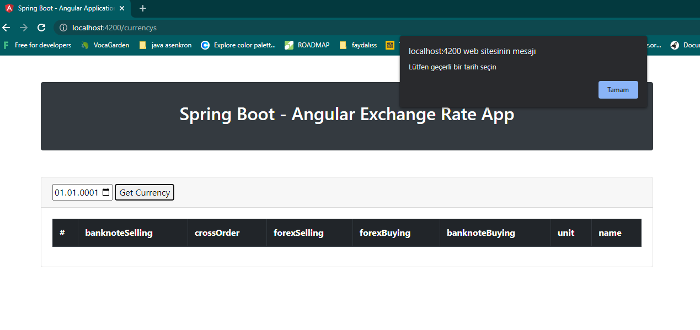

# TCMB Exchange Rate APP

Türkiye Cumhuriyeti Merkez Bankası (TCMB) tarafından yayınlanan döviz kurlarını seçili tarihe göre görebileceğiniz proje

## Teknolojiler

- Java 17.0.5 (geçici olarak)
- Kotlin 1.5.31
- AngularJS
- Spring Boot
- PostgreSQL
- Spring Data JPA


## Kurulum
## Frontend Uygulaması için;
[Buraya](https://github.com/Mduzgunn/exchange-rate-frontend) tıklayarak projeyi githubdan indirebilirsiniz.

Ardindan şu komutu girerek projeyi ayağa kaldırabilirsiniz.
```
$  ng serve
```
http://localhost:4200/ adresinden kontrol edebilirsiniz.

## Backend Uygulaması için;
[Buraya](https://github.com/Mduzgunn/exhangeRateApp) tıklayarak projeyi githubdan indirebilirsiniz.

Projeyi klonlayın
```bash
  git clone https://github.com/Mduzgunn/exhangeRateApp
```

Proje dizinine gidin
```bash
  cd exhangeRateApp
```

Gerekli paketleri yükleyin
```bash
  mvn clean install
```

Projeyi çalıştırın
```bash
  mvn spring-boot:run
```

## Kullanım
http://localhost:4200/ adresinde sizi karşılayan şu sayfada tarih seçerek seçtiğiniz tarihin verilerini alabilirsiniz.


Geçersiz bir tarih girildiğinde görseldeki gibi hata popup'ı görünecektir.


Veriler alınırken eğer bir hata ile karşılaşılmamışsa görseldeki gibi PostgreSQL'de oluşturduğumuz db'ye kaydedilecektir.


Eğer Frontend Uygulaması olmadan kullanmak istiyorsanız örnek olarak  http://localhost:8080/v1/api/list/ {yyyyMMdd örn -> 20230202} şeklinde tarih tanımlayıp verileri alabilirsiniz.
